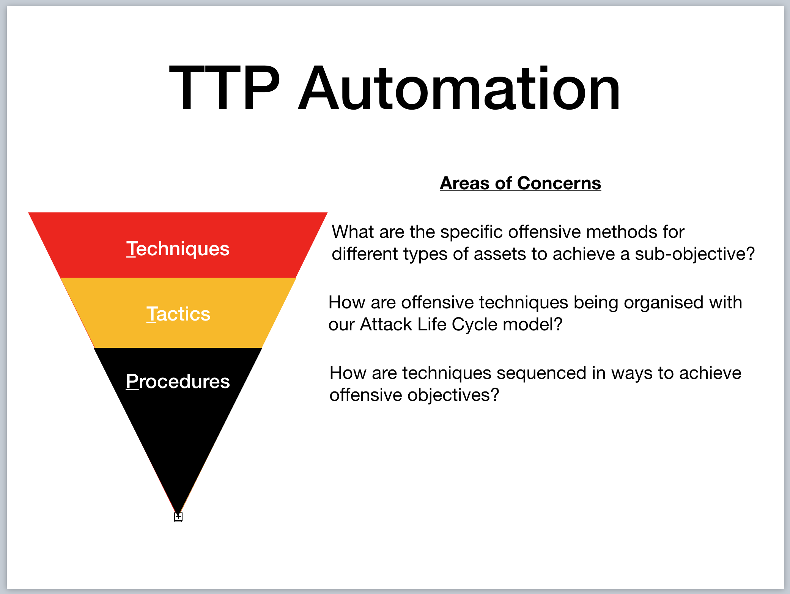
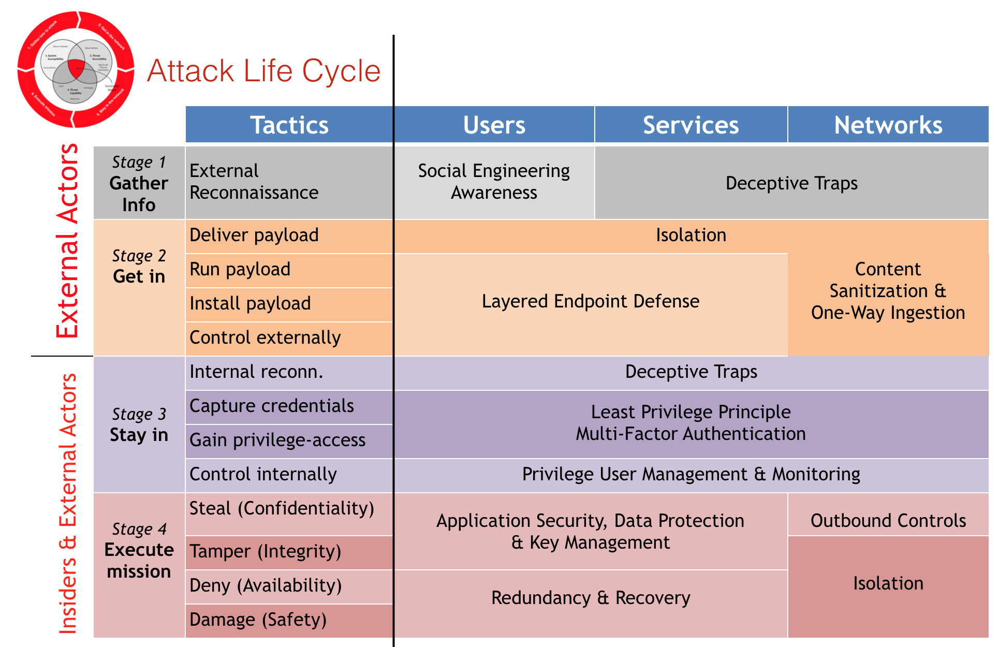
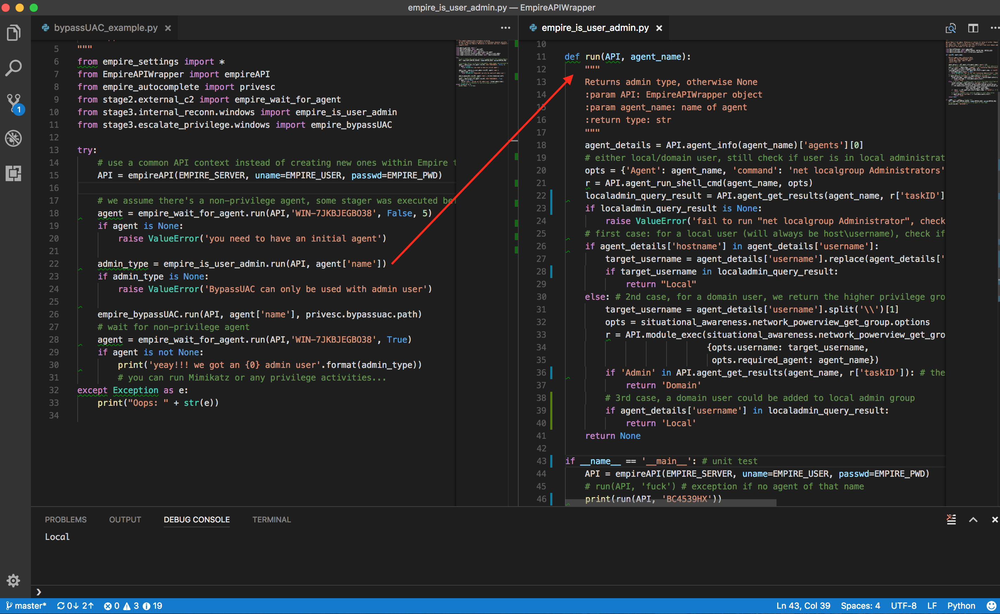
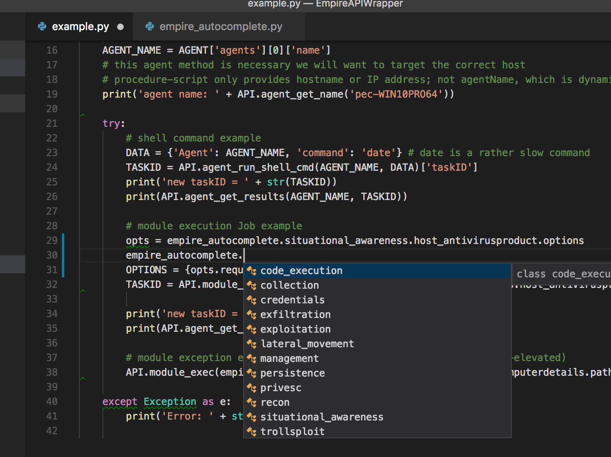
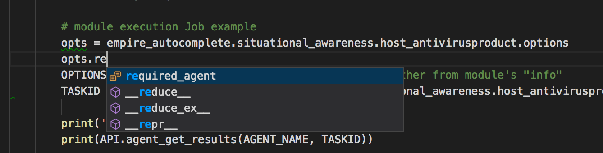

# AutoTTP
Automated Tactics Techniques &amp; Procedures. Re-running complex sequence manually for regression tests, product evaluations & so on can be tedious, so we toyed with the idea of making it easier to script [Empire](https://github.com/EmpireProject/Empire) (or any frameworks/products/toolkits that provide APIs like Metasploit (RPC), Cobalt-Strike & so on) using IDE like [Visual Studio Code](https://code.visualstudio.com) (or equivalent). This is still very much work in progress. 

## What is TTP?

In our case, the tactics are organized as per my [Attack Life Cycle model](https://jym.sg). One can use other models like Lockheed Martin's Kill-Chain(tm), Mandiant Attack Life Cycle & Mitre's ATT&CK (for post-exploitation). Whichever model it my be, *"Tactics" essentially help us group techniques together*:

Each "Tactics" row is associated to a "Stage". If you look into the source tree, the folder structure reflects this matrix. The matrix in this case also mentioned respective controls for each offensive tactic.

## How does Procedure look like?

The [file on the left](https://github.com/jymcheong/AutoTTP/blob/master/bypassUAC_procedure_example.py) is a procedure script, the other one is a [technique script](https://github.com/jymcheong/AutoTTP/blob/master/stage3/internal_reconn/windows/empire_is_user_admin.py). You will notice procedure scripting is not littered with too many Empire specific details, much of the details are encapsulated in technique script. 

The example of *"is user admin?"* actually consists of a few steps since there are at least 3 possibilities as spelt out in the script's comments. We can of course create custom "macros" in Empire, Metasploit & what not, but it becomes tightly integrated within a particular framework/product. We want to take advantage of the tools out there & organize reusable techniques into modules so as to mix & match at a Procedural level.

## How to make it easier?

I took advantage of the well-structured modules in Empire to create a auto-complete python class. Instead of typing the full module name (eg. powershell/situational_awareness....), just use IDE's autocomplete capabilities.

For each module, there will be options (for most if not all frameworks). The thing with Empire is once you run it as rest/headless (will touch on this later), there is NO console to look at the options. In the autocomplete helper class, each module has a *options* sub-class. The required options are prefix so we can populate them with values before running a module. Since there are 276 modules (as of Empire 2.1), this helper class will need some scripting to create too! Source: [https://gist.github.com/jymcheong/22c2eede978c8eb694945e3347c20c6b](https://gist.github.com/jymcheong/22c2eede978c8eb694945e3347c20c6b)

## Empire running with RESTful API & Console
As much we want to do everything in IDE, you will need console. The author of [DeathStar](https://github.com/byt3bl33d3r/DeathStar), already knew that while developing that script that automates the 0wning of Domain Admin using Empire. I borrowed his idea but adapted the threading approach for Empire 2.1 since his approach won't work for the refactored start restful api function. Source: [https://gist.github.com/jymcheong/6a7668ecf73c29dd1d234d1c76ef438c](https://gist.github.com/jymcheong/6a7668ecf73c29dd1d234d1c76ef438c)

