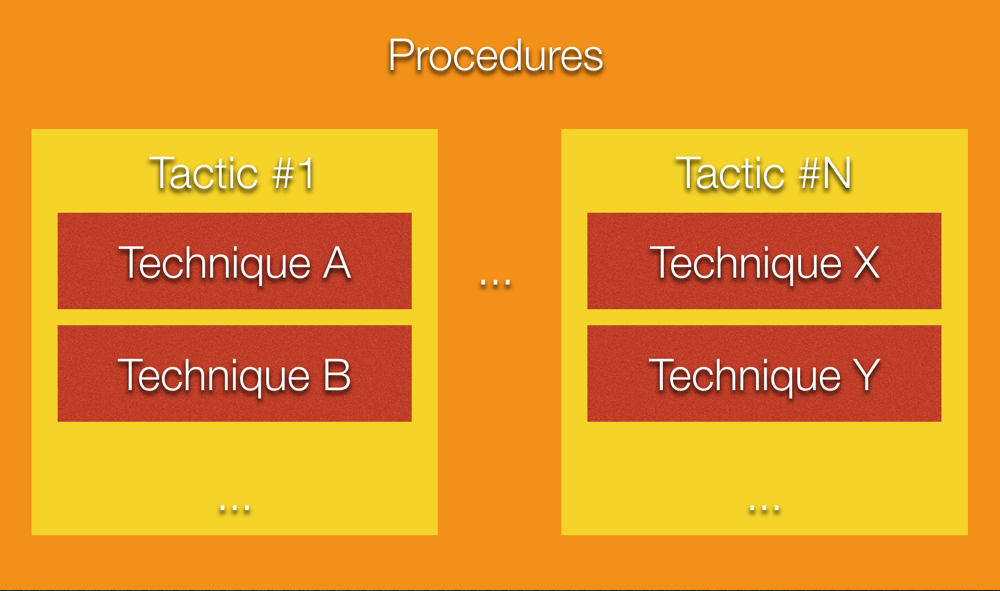
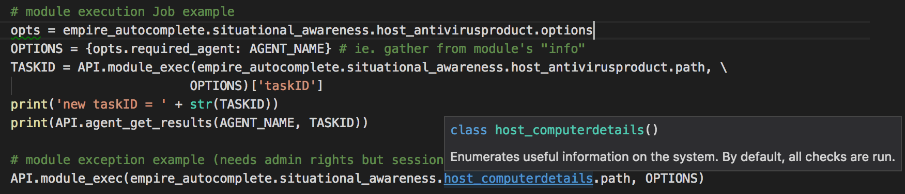

# AutoTTP
Automated Tactics Techniques &amp; Procedures. Re-running complex sequences manually for regression tests, product evaluations, generate data for researchers & so on can be tedious. I toyed with the idea of making it easier to script [Empire](https://github.com/EmpireProject/Empire) (or any frameworks/products/toolkits that provide APIs like Metasploit (RPC), Cobalt-Strike & so on) using IDE like [Visual Studio Code](https://code.visualstudio.com) (or equivalent). So I started to design AutoTTP. This is still very much work in progress. 

## What is TTP?

In my case, the tactics are organized as per my [Attack Life Cycle model](https://jym.sg). There are other models like [Lockheed Martin's Kill-Chain(R)](http://www.lockheedmartin.com/us/what-we-do/aerospace-defense/cyber/cyber-kill-chain.html), [Mandiant Attack Life Cycle](http://www.iacpcybercenter.org/resource-center/what-is-cyber-crime/cyber-attack-lifecycle/) & [Mitre's ATT&CK](https://attack.mitre.org) (for post-exploitation). Whichever model it my be, *a "Tactic" essentially groups techniques together*, eg. code-execution/run-payload can be achieved with many ways:

Each "Tactics" row is associated to a "Stage". If you look into the source tree, the folder structure reflects the matrix's Tactics column. The matrix also mentioned respective controls for each offensive tactic.

## How does Procedure look like?

The [file on the left](https://github.com/jymcheong/AutoTTP/blob/master/bypassUAC_procedure_example.py) is a procedure script, the other one is a [technique script](https://github.com/jymcheong/AutoTTP/blob/master/stage3/internal_reconn/windows/empire_is_user_admin.py). Notice that procedure scripting is not littered with too many Empire specific details, much of the details are encapsulated in the technique script. Procedure scripting should focus on the sequence of techniques using assets' information eg. hostname/ip, which email to send payload to, which payload technique & so on.

The example of *"is user admin?"* actually consists of a few steps since there are at least 3 possibilities as spelt out in the script's comments. We can of course create custom "macros" in Empire, Metasploit & what not, but it becomes tightly integrated within a particular framework/product. We want to take advantage of the tools out there & organize reusable techniques into modules so as to mix & match at a Procedural level (ie. the automation).

## How to make it easier?

I took advantage of the well-structured modules in Empire to create a auto-complete python class. Instead of typing the full module name (eg. powershell/situational_awareness....), just use IDE's autocomplete capabilities.

For each module, there are options (for most if not all frameworks). The thing with Empire is once you run it as rest/headless (will touch on this later), there is NO console to look at the module options. In the autocomplete-helper class, each module has a *options* sub-class. The required options are prefix as shown above, so we can populate those options with values first before calling a module. 

The description of each module is also included as part of the python class documentation & will display on hover over the class. Since there are 276 modules (as of Empire 2.1), this helper class will need some scripting to create! Source: [https://gist.github.com/jymcheong/22c2eede978c8eb694945e3347c20c6b](https://gist.github.com/jymcheong/22c2eede978c8eb694945e3347c20c6b)

With IDEs like Visual Studio Code (or equivalent), one can take advantage of debug variable watch, step through the script or even modify the script *while debugging/stepping* after knowing the return values structure. The REST APIs docs are there for Empire, but sometimes we don't exactly know the return values until we run the module. For that reason, it leads to the next topic.

## Empire with RESTful API listener & Console
As much we want to do everything in IDE, you will need console. The author of [DeathStar](https://github.com/byt3bl33d3r/DeathStar), already knew that while developing that script that automates the 0wning of Domain Admin using Empire. I borrowed his idea but adapted his threading approach for Empire 2.1 since his approach won't work for the refactored start restful api function. Source: [https://gist.github.com/jymcheong/6a7668ecf73c29dd1d234d1c76ef438c](https://gist.github.com/jymcheong/6a7668ecf73c29dd1d234d1c76ef438c)

## Credits
Shout outz to @radioboyQ for his EmpireAPIWrapper, @allfro & @Mikaayenson for pymetasploit, & to @byt3bl33d3r, MTFBWU. 
